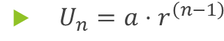
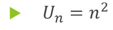
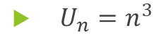
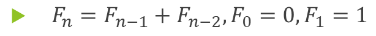

# Deretan dan Rekursi

## Deretan (Sequence)

- Deretan adalah suatu urutan atau susunan elemen atau objek yang disusun secara teratur berdasarkan suatu aturan tertentu. Elemen dalam deretan biasanya berupa angka, huruf, simbol, atau objek lainnya, dan urutannya dapat didasarkan pada pola, nilai, atau hubungan tertentu
- Definisi: Sebuah deretan adalah fungsi dari subset suatu himpunan bilangan bulat (biasanya N atau P) ke sebuah himpunan S.

N = {1, 2, 3, 4, … } <br>
   S misalnya {2, 4, 6, 8, …},   {1/3, 1/5, 1/7, …},  dsb
- Notasi deretan: {an}

Deretan umumnya dinyatakan dalam suatu formula, misalnya:
```
an = 2 n
an = 1/n
an = 7 – 3n
```

Dalam konteks matematika, deretan sering merujuk pada barisan bilangan, yaitu kumpulan bilangan yang disusun dalam suatu pola tertentu. Misalnya:
1. Deretan bilangan ganjil: 1,3,5,7,…
2. Deretan bilangan genap: 2,4,6,8,…
3. Deretan bilangan yang membentuk deret aritmetika: 3,6,9,12....

**Contoh-contoh deretan dan formulanya:**

### Deret Aritmetika
Deret dengan pola kenaikan atau penurunan tetap.
- Contoh: 2,5,8,11,14,...
- Rumus suku ke-n:


Di mana:
- a: suku pertama 
- b: beda (selisih antar suku
- n: nomor suku yang dicari

### Deret Geometri
Deret dengan pola kelipatan tetap.
- Contoh: 3,6,12,24,48,... 
- Rumus suku ke-n:


Di mana:
- a: suku pertama 
- r: rasio (perbandingan antar suku,
- n: nomor suku yang dicari

### Deret Bilangan Kuadrat
Deret dengan pola nilai berupa kuadrat bilangan bulat.
- Contoh: 1,4,9,16,25,...
- Rumus suku ke-n:


### Deret Bilangan Kubik
Deret dengan pola nilai berupa kubik bilangan bulat.
- Contoh: 1,8,27,64,125,...
- Rumus suku ke-n:


### Deret Fibonacci
Deret dengan pola di mana setiap suku merupakan jumlah dua suku sebelumnya.
- Contoh: 0,1,1,2,3,5,8,...
- Rumus suku ke-n (rekursif):


### String
- String adalah deretan berhingga karakter berbentu a1a2a3a4...an
Panjang string s adalah jumlah karakter di dalam string tersebut
Contoh: Informatika adalah string dengan panjang 11 karakter 10100101 adalah string biner dengan panjang 8 bit
- String kosong dilambangkan dengan $$ \lambda $$ , panjangnya = 0

#### Penjumlahan deretan
Jumlah deretan
am, am+1, am+2,...,an
adalah
am + am+1, + am+2 + ... an
atau dalam notasi sumasi:

$$ \Sigma_{km}^n $$ ak

- k adalah index summasi,
- m adalah batas bawah indeks,
- n adalah batas atas indeks

[//]: # (Terakhir slide 11)