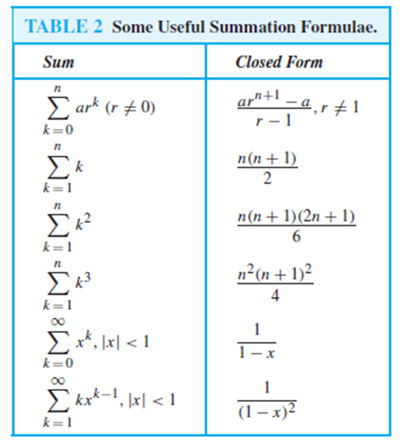

# Deretan dan Rekursi

## Deretan (Sequence)

- Deretan adalah suatu urutan atau susunan elemen atau objek yang disusun secara teratur berdasarkan suatu aturan tertentu. Elemen dalam deretan biasanya berupa angka, huruf, simbol, atau objek lainnya, dan urutannya dapat didasarkan pada pola, nilai, atau hubungan tertentu
- Definisi: Sebuah deretan adalah fungsi dari subset suatu himpunan bilangan bulat (biasanya N atau P) ke sebuah himpunan S.

N = {1, 2, 3, 4, … } <br>
   S misalnya {2, 4, 6, 8, …},   {1/3, 1/5, 1/7, …},  dsb
- Notasi deretan: {an}

Deretan umumnya dinyatakan dalam suatu formula, misalnya:
```
an = 2 n
an = 1/n
an = 7 – 3n
```

Dalam konteks matematika, deretan sering merujuk pada barisan bilangan, yaitu kumpulan bilangan yang disusun dalam suatu pola tertentu. Misalnya:
1. Deretan bilangan ganjil: 1,3,5,7,…
2. Deretan bilangan genap: 2,4,6,8,…
3. Deretan bilangan yang membentuk deret aritmetika: 3,6,9,12....

**Contoh-contoh deretan dan formulanya:**

### Deret Aritmetika
Deret dengan pola kenaikan atau penurunan tetap.
- Contoh: 2,5,8,11,14,...
- Rumus suku ke-n:
$$ U_n = a + (n - 1) \cdot b$$

Di mana:
- a: suku pertama 
- b: beda (selisih antar suku
- n: nomor suku yang dicari

### Deret Geometri
Deret dengan pola kelipatan tetap.
- Contoh: 3,6,12,24,48,... 
- Rumus suku ke-n:
$$ U_n = a \cdot r^{(n-1)} $$

Di mana:
- a: suku pertama 
- r: rasio (perbandingan antar suku,
- n: nomor suku yang dicari

### Deret Bilangan Kuadrat
Deret dengan pola nilai berupa kuadrat bilangan bulat.
- Contoh: 1,4,9,16,25,...
- Rumus suku ke-n:
$$ U_n = n^2 $$

### Deret Bilangan Kubik
Deret dengan pola nilai berupa kubik bilangan bulat.
- Contoh: 1,8,27,64,125,...
- Rumus suku ke-n:
$$ U_n = n^3 $$

### Deret Fibonacci
Deret dengan pola di mana setiap suku merupakan jumlah dua suku sebelumnya.
- Contoh: 0,1,1,2,3,5,8,...
- Rumus suku ke-n (rekursif):
$$ F_n = F_{n-1} + F_{n-2}, F_0 = 0, F_1=1$$


## String
- String adalah deretan berhingga karakter berbentuk
$$ a_1a_2a_3a_4...a_n $$
Panjang string S adalah jumlah karakter di dalam string tersebut
- Contoh: Informatika adalah string dengan panjang 11 karakter 10100101 adalah string biner dengan panjang 8 bit
- String kosong dilambangkan dengan $$ \lambda $$ , panjangnya = 0

#### Penjumlahan deretan
Jumlah deretan
$$ a_m, a_{m+1}, a_{m+2},...,a_n $$
adalah
$$ a_m + a_{m+1}, + a_{m+2} + ... + a_n $$
atau dalam notasi sumasi:

$$ \Sigma_{k=m}^n  a_k $$

- _k_ adalah index summasi,
- _m_ adalah batas bawah indeks,
- _n_ adalah batas atas indeks

Contoh 2: Berapa nilai: $$ \sum_{k=1}^{5} k^2 $$
Jawaban:
$$ \sum_{k=1}^{5} k^2 = 1^2 + 2^2 + 3^2 + 4^2 + 5^2 = 1 + 4 + 9 + 16 + 25 = 55 $$

Contoh 3: Batas bawah sumasi kadangkala perlu digeser agar dapat dijumlahkan dengan sumasi lain yang memiliki batas bawah berbeda. Pada contoh 2 diatas batas bawah digeser dari 1 menjadi 0, akibatnya:
$$ \sum_{k=1}^{5} k^2 = \sum_{k=0}^{4} (k+1)^2 $$

Contoh 4: Sumasi dapat di pecah dengan membagi dua indeksnya, misalnya
$$ \sum_{k=1}^{100} k^2 = \sum_{k=1}^{49} k^2 + \sum_{k=50}^{100} k^2 $$
[//]: # (Slide 12)
##### Tugas pembuktian dari 3 rumus dibawah
Beberapa sumasi sudah ditemukan rumus penjumlahannya sebagai berikut:



Contoh 5: Hitung nilai $$  \sum_{k=50}^{100} k^2 $$
Jawaban:$$ \sum_{k=1}^{100} k^2 = \sum_{k=1}^{49} k^2 + \sum_{k=50}^{100} k^2 $$

$$ \sum_{k=50}^{100} k^2 = \sum_{k=1}^{100} k^2 - \sum_{k=1}^{49} k^2 $$

Gunakan rumus:
$$ \sum_{k=1}^{n} k^2 = \frac{n(n+1)(2n+1)}{6} $$
$$ \sum_{k=50}^{100} k^2 = \frac{100(101)(201)}{6} - \frac{49(50)(99)}{6} = 338,350 - 40,425 = 297,925 $$


### Sumasi ganda
Di dalam algoritma, kita perlu menghitung berapa kali suatu operasi tertentu dilakukan di dalam sebuah kalang bersarang (nested loop)
. Penjumlahan semua operasi di dalam kalang bersarang dinyatakan dalam bentuk sumasi ganda.

$$ \sum_{i=1}^{4} \sum_{j=1}^3 ij $$

Untuk menghitung sumasi ganda, mula-mula ekspansi sumasi terdalam, lalu dilanjutkan dengan sumasi terluar:
$$ \sum_{i=1}^{4} \sum_{j=1}^{3} ij = \sum_{i=1}^{4} (i + 2i + 3i) = \sum_{i=1}^{4} 6i = 6 + 12 + 18 + 24 = 60 $$

Contoh penggunaan: Berapa kali operasi + dilakukan didalam algoritma di bawah ini
```
x = 0
for j = 1 to 10 do
    for k = 1 to j do
        x = x + 2
    end for
end for
```
Penyelesaian: <br>
Operasi + terdapat di dalam pernyataan x = x + 2<br>
Operasi ini di lakukan satu kali pada setiap pengulangan<br>
Jumlah seluruh operasi + adalah:
$$ t = \sum_{j=1}^{10} \sum_{k=1}^{j} 1 \\
   = \sum_{j=1}^{10} (1 + 1 + ... + 1 \text{ sebanyak } j \text{ kali}) \\
   = \sum_{j=1}^{10} j \\
   = \frac{10(10+1)}{2} = 55 
$$
Latihan:
1. Tentukan nilai
$$ \sum_{k=1}^{8} 2^k + \sum_{k=2}^{8} (-3)^k $$
2. Twntukan nilai
$$ \sum_{i=0}^{2} \sum_{j=0}^{3} (2i + 3j) $$
3. Tentukan nilai
$$ \sum_{i=0}^{3} \sum_{j=0}^{2} i $$

## Rekursi

- Sebuah objek dikatakan **rekursi** _(recursive)_ jika ia didefinisikan dalam terminologi dirinya sendiri.
- Proses mendefinisikan objek dalam terminologi dirinya sendiri disebut rekursi (recursion).
- Objek fraktal adalah contoh bentuk rekursif


### Fungsi rekursif


Contoh 7: Nyatakan n! dalam definisi rekursif
Solusi: 

Misalkan f(n) = n!, maka


Menghitung 5! secara rekursif adalah:


#### ALgoritma menghitung faktorial:

function Faktorial (input n:integer) -> integer
{ mengembalikan nilai n!;
basis: jika n = 0, maka 0! = 1
rekuens: jika n > 0, maka n! = n x (n-1)!
}

DEKLARASI

ALGORITMA:
```
if n = 0 then
   return 1    {basis}
else
   return * Faktorial(n-1) {rekuens}
end
```

Contoh 8; barisan Fibonacci 0,1,1,2,3,5,8,11,10,... Dapat dinyatakan secara rekursif sebagai berikut:


Contoh 9: Fungsi (polinom) Chebyshev dinyatakan sebagai


Contoh 10: Sumasi  didefinisikan secara rekursif sebagai berikut:


sehingga 


Solusi:
1. 
sehingga: 
2.  => 

### Struktur Rekursif
- Struktur data yang penting dalam komputer adalah pohon biner (binary tree).


- simpul (node) pada pohon biner mempunyai paling banyak dua buah anak.
- Jumlah anak pada setiap simpul bisa 1, 2, atau 0.
- Simpul yang mempunyai anak disebut simpul cabang (branch node) atau simpul dalam (Interval node)
- Simpul yang tidak mempunyai anak disebut simpul daun (leave)

#### Pohon biner
Pohon biner adalah stuktur yang rekursif, sebab setiap simpul mempunyai cabang yang juga berupa pohon. Setiap cabang disebut upapohon (subtree)


- Oleh karena itu, pohon daoat didefinisikan secara rekursif sebagi berikut:
  (i) Basis: kosong adalah pohon biner
  (ii) Rekurens: Jika T1 dan T2 adalah pohon biner , maka adalah pohon biner

Proses pembentukan pohon biner secara rekursif:
(i) 
(ii) 
